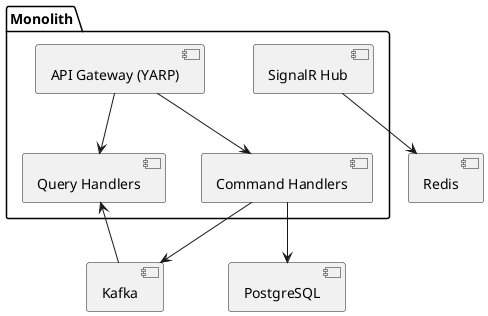
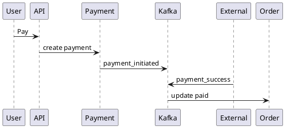

# SPEC-1-Uber-Food-Modular-Monolith

## Background

Combined ride-hailing + food delivery platform built as a **modular monolith (ASP.NET Core 8)** with clear boundaries to evolve into microservices. Designed from day one for **CQRS**, **event-driven flows (Kafka)**, **real-time tracking (SignalR + Redis)**, and **region partitioning** for future multi-region deployments.

---

## Requirements

### Must Have (M)
- Auth (users, drivers, restaurants)
- Ride booking + driver matching
- Food ordering + restaurant workflow
- Real-time tracking (≤1s latency)
- CQRS (separate read/write models)
- Kafka-based eventing
- Redis for geo + hot state
- Region-based partitioning
- Payments (mock integration)

### Should Have (S)
- Notifications (SignalR)
- Retry + idempotency
- Driver availability

### Could Have (C)
- Surge pricing
- Promotions

### Implemented Features (beyond base spec)
- **Surge Pricing** — dynamic multiplier engine driven by supply/demand ratio per region
- **Ride Pooling** — shared rides with pool queue, compatibility matching, and solo-upgrade flow
- **Driver & Restaurant Dashboards** — analytics module with daily stats, export (CSV/PDF), and admin overview
- **In-App Chat** — real-time rider↔driver and rider↔restaurant messaging (isolated module)

---

## Method

### Architecture (Modular Monolith + CQRS)

Write side (commands) and Read side (queries) separated per module:
- Ride (Command + Query)
- Order (Command + Query)
- Payment
- Tracking

Pattern:
- Controllers → Command Handlers (write)
- Controllers → Query Handlers (read)
- Writes emit Kafka events
- Reads served from denormalized tables

---

### Authentication & Authorization

- **Access model**: OAuth2-style bearer tokens with short-lived JWT access tokens + long-lived refresh tokens.
- **Roles (RBAC)**:
  - `rider`: request rides, place food orders, view own status.
  - `driver`: accept rides/orders, update location, update trip/delivery status.
  - `restaurant`: accept/prepare food orders and update readiness.
- **JWT claims** include `sub` (user id), `role`, `region_id`, and `exp`.
- **Token flow through YARP**:
  1. Client authenticates against Auth module and receives access + refresh token.
  2. Client calls `/v1/*` APIs with `Authorization: Bearer <access_token>`.
  3. YARP validates JWT signature/expiry (via Auth-issued signing keys/JWKS, cached for 1 hour with ±10% jitter; refresh on `kid` miss/rotation) and forwards role/subject claims to downstream handlers.
  4. Expired access tokens are renewed via `/v1/auth/refresh` using refresh token rotation.
- **Refresh strategy**:
  - Access token TTL: 15 minutes.
  - Refresh token TTL: configurable via `Jwt:RefreshTokenTtlDays` (default 30 days), stored hashed and revocable.
  - On refresh: rotate refresh token, invalidate previous token, and issue new access token.
- **Identity binding**: all controllers derive `UserId`, `Role`, and `RegionId` from JWT claims via `ICurrentUserContext` — caller-supplied identity fields in request bodies are ignored.
- **Startup validation**: `Jwt:Secret` must be ≥ 32 characters; the application will not start with a weak secret.

---

### Driver Matching Algorithm (Scored)

Instead of nearest-only, we compute a **matching score** and select the **highest** score:

Score = (w1 * proximity_score) + (w2 * driver_rating) + (w3 * availability_score)

Where:
- proximity_score = `1 / (1 + distance_km)` from Redis GEO distance, using the **actual ride pickup coordinates**
- driver_rating → from DB/cache
- availability_score → based on idle time
- `w1`, `w2`, and `w3` are positive normalized weights (`w1 + w2 + w3 = 1`)

Flow:
1. Fetch nearby drivers (Redis GEO, radius 3–5km, queried from actual pickup lat/lng)
2. Enrich with rating + availability
3. Compute score
4. Select highest score

---

### API Gateway + Rate Limiting

Use **YARP (Yet Another Reverse Proxy)** inside ASP.NET Core.

Responsibilities:
- Routing
- Authentication
- Rate limiting
- Region routing (based on region_id)

---

### Rate Limiting Strategy

Use **token bucket (Redis-backed)** implemented as `RedisRateLimiterMiddleware` with an atomic Lua script. Limits are configurable via the `RateLimiting` config section. The middleware **fails open** — a Redis outage does not block requests.

Keys:
- `rate_limit:rider:{userId}`
- `rate_limit:driver:{userId}`
- `rate_limit:restaurant:{userId}`

Config (defaults):
- Rider: 100 requests / minute
- Driver: 300 requests / minute + 20 requests / second for location updates
- Restaurant: 200 requests / minute
- Anonymous: 20 requests / minute

Returns `429 Too Many Requests` with a `Retry-After` header on limit breach.

---

### Component Diagram



---

### Region Partitioning

All entities include `region_id`.

Kafka topics:
- ride-events-{region}
- order-events-{region}
- payment-events-{region}
- ride-events-dlq-{region}
- order-events-dlq-{region}
- payment-events-dlq-{region}

Redis:
- driver_locations:{region}

---

### Real-Time Tracking

- Driver sends location every 2–3s
- Stored in Redis GEO; driver heartbeat TTL tracked in a **per-member sorted set** (`driver_ttl:{regionId}`) — stale drivers are pruned atomically via Lua on the next nearby-driver query without evicting the entire region
- SignalR pushes updates to clients
- Redis is also used as the **SignalR backplane** for multi-instance fan-out
- `ride_views` is populated asynchronously by `RideViewConsumer` (Kafka consumer) — never written to directly from the application layer

---

### Payment Flow

- Payment initiated after ride/order creation
- Mock external provider (Stripe/GCash-like)
- Status via Kafka events



---

### Reliability Patterns

- Outbox Pattern (DB → Kafka) — events are persisted atomically before publish
- Idempotency keys
- Retry with exponential backoff + jitter (max 5 attempts)
- Kafka DLQ per region (`{eventType}-dlq`) — failed outbox entries are **published** to the DLQ topic before being marked dead, ensuring a full replay path
- Payment timeout: after 15 minutes with no provider callback, emits `payment_timeout` event with `refund_required=true` and `notify_user=true` on a region-scoped topic (`payment-events-timeout-{regionId}`)

---

### State Machines

#### Ride state machine

`requested → matched → en_route → arrived → completed → cancelled`

#### Food order state machine

`placed → accepted → preparing → ready → picked_up → delivered`

---

### Error Handling & Failure Modes

- **Zero candidates in matching**: ride remains `requested`; return `202 Accepted` with `pending_match`, retry matching with expanding radius/backoff, and notify client on assignment via SignalR (or client polling `GET /v1/rides/{id}` fallback).
- **Kafka consumer failures**: retry with exponential backoff + jitter; persist retry count; route to region DLQ after 5 failed retries.
- **Stale Redis GEO data**: require heartbeat TTL (10 seconds) for online drivers; on expiry + 5-second grace window, atomically mark driver as `offline` and remove from region geo index.
- **Payment callback timeout**: move payment to `pending_confirmation`, poll provider/webhook retry every 30 seconds for bounded period (e.g., 15 min), then mark `failed_timeout` and emit compensating event (`payment_timeout`) containing `entity_id`, `reason`, `refund_required`, and `notify_user`.

---

### Observability

- **OpenTelemetry** for distributed tracing across gateway, handlers, Kafka producers/consumers, Redis, and PostgreSQL — configured with ASP.NET Core and HTTP client instrumentation.
- **Structured logging** (Serilog JSON) with `TraceId` and `SpanId` automatically enriched on every log line via `Serilog.Enrichers.Span`, plus correlation IDs (`trace_id`, `ride_id`, `order_id`, `region_id`).
- **Health checks** for PostgreSQL, Redis, and Kafka at `/health/readiness`; liveness at `/health`.
- Swagger UI only exposed in `Development` environment.

---

## Implementation

### Tech
- ASP.NET Core 8
- PostgreSQL (write + read DB)
- Redis (geo + cache)
- Kafka (event bus)

---

### Write DB Schema

```sql
CREATE TABLE rides (
  id UUID PRIMARY KEY,
  rider_id UUID,
  driver_id UUID,
  status TEXT,
  pickup_lat DOUBLE PRECISION,
  pickup_lng DOUBLE PRECISION,
  region_id INT,
  version BIGINT NOT NULL DEFAULT 1,
  created_at TIMESTAMP
);

CREATE TABLE restaurants (
  id UUID PRIMARY KEY,
  name TEXT NOT NULL,
  status TEXT NOT NULL,
  region_id INT NOT NULL,
  created_at TIMESTAMP
);

CREATE TABLE orders (
  id UUID PRIMARY KEY,
  rider_id UUID NOT NULL,
  restaurant_id UUID NOT NULL REFERENCES restaurants(id),
  driver_id UUID,
  status TEXT NOT NULL,
  total_amount NUMERIC NOT NULL,
  region_id INT NOT NULL,
  version BIGINT NOT NULL DEFAULT 1,
  created_at TIMESTAMP
);

CREATE TABLE order_items (
  id UUID PRIMARY KEY,
  order_id UUID NOT NULL REFERENCES orders(id) ON DELETE CASCADE,
  item_name TEXT NOT NULL,
  quantity INT NOT NULL,
  unit_price NUMERIC NOT NULL,
  subtotal NUMERIC NOT NULL
);

CREATE TABLE payments (
  id UUID PRIMARY KEY,
  entity_id UUID,
  type TEXT,
  status TEXT,
  amount NUMERIC,
  region_id INT
);
```

Optimistic concurrency pattern (prevents double-acceptance race):

```sql
UPDATE rides
SET driver_id = :driverId,
    status = 'matched',
    version = version + 1
WHERE id = :rideId
  AND status = 'requested'
  AND version = :expectedVersion;
```

Apply the same `version`-checked update pattern on `orders` transitions.
If affected rows = 0, treat as concurrency conflict (`409 Conflict`), return only minimal metadata (`entity_id`, `current_version`), and require authorized `GET` to fetch full latest state.

---

### Read Model (Denormalized)

```sql
CREATE TABLE ride_views (
  ride_id UUID,
  driver_name TEXT,
  status TEXT,
  lat DOUBLE PRECISION,
  lng DOUBLE PRECISION
);
```

Updated via Kafka consumers.

---

### Redis GEO

```csharp
await redis.GeoAddAsync($"driver_locations:{regionId}", lng, lat, driverId);
```

---

### SignalR

```csharp
await _hub.Clients.Group(rideId)
    .SendAsync("location_update", lat, lng);
```

---

### Kafka + Outbox

```sql
CREATE TABLE outbox (
  id UUID,
  payload JSONB,
  status TEXT
);
```

Background worker publishes to Kafka.

---

### Feature Modules

#### Surge Pricing (`Gruuber.SurgePricing`)

Dynamic fare multiplier based on supply/demand ratio per region. Activates when demand exceeds supply threshold.

- **`SurgePricingEngine`** — computes multiplier: `demand / max(1, supply)`, clamped to configurable max (default 3×)
- **`SurgeMultiplierConsumer`** — Kafka `BackgroundService` consuming ride/order events to track supply/demand counters in Redis
- **`SurgePricingController`** — `GET /v1/surge/{regionId}` (current multiplier), `POST /v1/surge/{regionId}/override` (admin), `DELETE /v1/surge/{regionId}/override` (admin)
- Redis keys: `surge:demand:{regionId}`, `surge:supply:{regionId}`, `surge:override:{regionId}` (TTL-based)
- Multiplier applied at ride/order creation; stored on the entity at time of booking

#### Ride Pooling (`Gruuber.Rides`)

Shared rides where up to 2 riders share a driver, with pricing incentive for pooling.

- **Pool queue** — rides in `PoolQueued` status wait up to 5 minutes for a compatible match (same region, nearby pickup/dropoff)
- **`PoolMatcherService`** — background sweep every 30s; pairs compatible pool candidates and transitions them to `Matched`
- **`PoolTimeoutWorker`** — background sweep every 30s; cancels rides that exceed pool wait timeout
- **`AcceptSoloUpgradeHandler`** — rider can opt out of pool queue early via `POST /v1/rides/{id}/accept-solo-upgrade`
- State: `requested → pool_queued → matched → en_route → arrived → completed | cancelled`

#### Driver & Restaurant Dashboards (`Gruuber.Analytics`)

Separate analytics module with its own `AnalyticsDbContext` (never touches ride/order write tables).

- **`AnalyticsConsumerService`** — Kafka consumer building daily aggregated stats from `ride_completed`, `ride_cancelled`, `order_delivered`, `order_cancelled`, `payment_success` events
- **`DriverDashboardQueryHandler`** — weekly earnings, trip count, ratings summary
- **`RestaurantDashboardQueryHandler`** — revenue by period, order counts, menu item performance (sorted by units sold)
- **`AdminDashboardQueryHandler`** — platform-wide metrics: active drivers, revenue, order volume
- **`ExportJobService`** — async export pipeline (CSV via CsvHelper, PDF via QuestPDF); client polls job status
- Idempotency via `processed_analytics_events` dedup table

**Analytics endpoints** (`/v1/analytics/`)
- `GET /v1/analytics/driver/summary` — driver weekly summary
- `GET /v1/analytics/driver/earnings` — earnings by date range
- `GET /v1/analytics/restaurant/summary` — restaurant performance summary
- `GET /v1/analytics/restaurant/menu` — menu item performance
- `GET /v1/analytics/admin/summary` — platform-wide overview
- `POST /v1/analytics/{role}/exports` — enqueue export job
- `GET /v1/analytics/{role}/exports/{jobId}` — poll export status + download URL

#### In-App Chat (`Gruuber.Chat`)

Isolated real-time chat module — **intentionally no FK to rides/orders** for clean future microservice extraction.

- **`ChatHub`** (SignalR) — real-time messaging; groups by `chat:{threadId}` (separate from `LocationHub`)
  - `JoinThread` — joins group, marks inbound messages as `delivered`
  - `SendMessage` — validates thread active, persists, broadcasts `MessageReceived`
  - `MarkRead` — updates delivery status, broadcasts `MessageRead` read receipts
- **`ChatEventProcessor` + `ChatThreadConsumer`** — Kafka consumer auto-creates threads on `ride_matched` (1 thread: rider↔driver) and `order_accepted` (2 threads: rider↔driver, rider↔restaurant); idempotent
- **`ChatThreadClosureWorker`** — 5-min sweep; marks threads past `closes_at` as `read_only`
- **`ChatQueryHandler`** — paginated message history (oldest-first), thread list, quick reply templates
- Display names are always anonymized role labels: `"Your Rider"`, `"Your Driver"`, `"Restaurant Staff"` — never PII
- Thread auto-expires 24h after creation via `closes_at`

**Chat endpoints** (`/v1/chat/`)
- `GET /v1/chat/threads` — list user's threads (filtered by `context_id`)
- `GET /v1/chat/threads/{threadId}/messages` — paginated messages (403 if not a participant)
- `GET /v1/chat/quick-replies` — quick reply templates by role + locale

**Chat hub** — `wss://.../hubs/chat`

---

### APIs

**Auth**
- `POST /v1/auth/register` — create account (role: rider / driver / restaurant)
- `POST /v1/auth/login`
- `POST /v1/auth/refresh`

**Rides**
- `POST /v1/rides/request` — rider creates a ride request *(requires `rider` role)*
- `POST /v1/rides/{id}/match` — driver triggers matching *(requires `driver` role)*
- `PATCH /v1/rides/{id}/status` — lifecycle transitions (en_route → arrived → completed, or cancel)
- `GET /v1/rides/{id}` — poll ride status

**Orders**
- `POST /v1/orders/create` — rider places a food order *(requires `rider` role)*
- `PATCH /v1/orders/{id}/status` — transition order state
- `GET /v1/orders/{id}` — get order with items
- `GET /v1/orders/{id}/items` — get order items only

**Payments**
- `POST /v1/payments/initiate` — initiate payment *(requires `rider` role)*
- `POST /v1/payments/{id}/confirm` — mark payment confirmed *(requires `driver` role)*
- `POST /v1/payments/{id}/fail` — mark payment failed *(requires `driver` role)*
- `GET /v1/payments/{id}` — poll payment status

**Tracking**
- `POST /v1/drivers/location` — driver heartbeat/location update *(requires `driver` role)*

**Surge Pricing**
- `GET /v1/surge/{regionId}` — get current surge multiplier for a region
- `POST /v1/surge/{regionId}/override` — admin override multiplier *(requires `admin` role)*
- `DELETE /v1/surge/{regionId}/override` — remove admin override *(requires `admin` role)*

**Ride Pooling**
- `POST /v1/rides/{id}/accept-solo-upgrade` — rider opts out of pool queue early *(requires `rider` role)*

**Analytics / Dashboards**
- `GET /v1/analytics/driver/summary` — driver weekly summary *(requires `driver` role)*
- `GET /v1/analytics/driver/earnings` — earnings by date range *(requires `driver` role)*
- `GET /v1/analytics/restaurant/summary` — restaurant performance summary *(requires `restaurant` role)*
- `GET /v1/analytics/restaurant/menu` — menu item performance *(requires `restaurant` role)*
- `GET /v1/analytics/admin/summary` — platform-wide overview *(requires `admin` role)*
- `POST /v1/analytics/{role}/exports` — enqueue CSV or PDF export job
- `GET /v1/analytics/{role}/exports/{jobId}` — poll export job status + download URL

**In-App Chat**
- `GET /v1/chat/threads` — list threads the caller is a participant in
- `GET /v1/chat/threads/{threadId}/messages` — paginated message history *(403 if not a participant)*
- `GET /v1/chat/quick-replies` — quick reply templates by role and locale
- SignalR hub: `wss://.../hubs/chat` — real-time messaging (JoinThread, SendMessage, MarkRead)

---

### API Versioning

- Use URL-based versioning (`/v1/...`) at the gateway and module endpoints.
- Non-breaking additions stay in `v1`; breaking changes introduce `/v2`.
- Maintain at least one overlapping supported version during migrations.

---

### Schema Versioning & Data Migration

- Manage schema via versioned migrations (EF Core migrations or Flyway).
- Each migration is forward-only, idempotent in CI/CD, and tracked in schema history.
- For future service split, keep shared contracts backward-compatible and run expand/contract migrations.

---

### Scaling Plan

- Split modules → microservices
- Kafka already decouples
- Read DB per service
- Redis cluster per region

---

## Milestones

1. Base monolith + modules
2. CQRS setup
3. Redis geo tracking
4. Kafka + outbox
5. Ride + order flows
6. Payment integration
7. SignalR real-time
8. Surge Pricing — dynamic fare multiplier (supply/demand, Redis-backed, admin override)
9. Ride Pooling — shared rides with pool queue, match sweep, solo-upgrade escape hatch
10. Driver & Restaurant Dashboards — analytics module with daily stats aggregation + CSV/PDF export
11. In-App Chat — isolated real-time chat module (SignalR hub + Kafka auto-thread creation)
12. Load test targets:
   - 10,000 concurrent users
   - 120 ride requests/sec sustained
   - 80 food orders/sec sustained
   - API latency (all synchronous app-owned request/response handling, including `/payments/initiate` validation + payment record persistence + outbox/event write before async handoff; external provider callback delivery and any async webhook completion are excluded): p50 < 150ms, p95 < 400ms, p99 < 800ms

---

## Gathering Results

- Matching latency (<500ms)
- Tracking delay (<1s)
- Kafka lag
- Payment success rate
