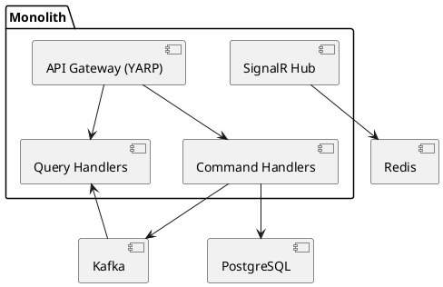
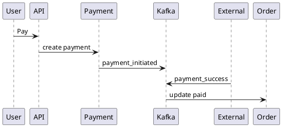

# SPEC-1-Uber-Food-Modular-Monolith

## Background

Combined ride-hailing + food delivery platform built as a **modular monolith (ASP.NET Core 8)** with clear boundaries to evolve into microservices. Designed from day one for **CQRS**, **event-driven flows (Kafka)**, **real-time tracking (SignalR + Redis)**, and **region partitioning** for future multi-region deployments.

---

## Requirements

### Must Have (M)
- Auth (users, drivers, restaurants)
- Ride booking + driver matching
- Food ordering + restaurant workflow
- Real-time tracking (≤1s latency)
- CQRS (separate read/write models)
- Kafka-based eventing
- Redis for geo + hot state
- Region-based partitioning
- Payments (mock integration)

### Should Have (S)
- Notifications (SignalR)
- Retry + idempotency
- Driver availability

### Could Have (C)
- Surge pricing
- Promotions

---

## Method

### Architecture (Modular Monolith + CQRS)

Write side (commands) and Read side (queries) separated per module:
- Ride (Command + Query)
- Order (Command + Query)
- Payment
- Tracking

Pattern:
- Controllers → Command Handlers (write)
- Controllers → Query Handlers (read)
- Writes emit Kafka events
- Reads served from denormalized tables

---

### Driver Matching Algorithm (Scored)

Instead of nearest-only, we compute a **matching score**:

Score = (w1 * distance) + (w2 * driver_rating) + (w3 * availability_score)

Where:
- distance → from Redis GEO
- driver_rating → from DB/cache
- availability_score → based on idle time

Flow:
1. Fetch nearby drivers (Redis GEO, radius 3–5km)
2. Enrich with rating + availability
3. Compute score
4. Select lowest score

Pseudo:
```csharp
var candidates = geoDrivers.Select(d => new {
    d.Id,
    Score = w1 * d.Distance + w2 * d.Rating + w3 * d.Availability
});

var best = candidates.OrderBy(x => x.Score).First();
```

---

### API Gateway + Rate Limiting

Use **YARP (Yet Another Reverse Proxy)** inside ASP.NET Core.

Responsibilities:
- Routing
- Authentication
- Rate limiting
- Region routing (based on region_id)

---

### Rate Limiting Strategy

Use **token bucket (Redis-backed)**:

Keys:
- rate_limit:user:{userId}

Config:
- 100 requests / minute (user)
- 20 requests / second (driver location updates)

Redis Lua script for atomicity.

---

### Component Diagram



---

### Region Partitioning

All entities include `region_id`.

Kafka topics:
- ride-events-{region}
- order-events-{region}
- payment-events-{region}

Redis:
- driver_locations:{region}

---

### Real-Time Tracking

- Driver sends location every 2–3s
- Stored in Redis GEO
- SignalR pushes updates to clients

---

### Payment Flow

- Payment initiated after ride/order creation
- Mock external provider (Stripe/GCash-like)
- Status via Kafka events



---

### Reliability Patterns

- Outbox Pattern (DB → Kafka)
- Idempotency keys
- Retry with backoff

---

## Implementation

### Tech
- ASP.NET Core 8
- PostgreSQL (write + read DB)
- Redis (geo + cache)
- Kafka (event bus)

---

### Write DB Schema

```sql
CREATE TABLE rides (
  id UUID PRIMARY KEY,
  rider_id UUID,
  driver_id UUID,
  status TEXT,
  region_id INT,
  created_at TIMESTAMP
);

CREATE TABLE payments (
  id UUID PRIMARY KEY,
  entity_id UUID,
  type TEXT,
  status TEXT,
  amount NUMERIC,
  region_id INT
);
```

---

### Read Model (Denormalized)

```sql
CREATE TABLE ride_views (
  ride_id UUID,
  driver_name TEXT,
  status TEXT,
  lat DOUBLE PRECISION,
  lng DOUBLE PRECISION
);
```

Updated via Kafka consumers.

---

### Redis GEO

```csharp
await redis.GeoAddAsync($"driver_locations:{regionId}", lng, lat, driverId);
```

---

### SignalR

```csharp
await _hub.Clients.Group(rideId)
    .SendAsync("location_update", lat, lng);
```

---

### Kafka + Outbox

```sql
CREATE TABLE outbox (
  id UUID,
  payload JSONB,
  status TEXT
);
```

Background worker publishes to Kafka.

---

### APIs

- POST /rides/request
- POST /orders/create
- POST /payments/initiate
- POST /drivers/location

---

### Scaling Plan

- Split modules → microservices
- Kafka already decouples
- Read DB per service
- Redis cluster per region

---

## Milestones

1. Base monolith + modules
2. CQRS setup
3. Redis geo tracking
4. Kafka + outbox
5. Ride + order flows
6. Payment integration
7. SignalR real-time
8. Load test (<10k users)

---

## Gathering Results

- Matching latency (<500ms)
- Tracking delay (<1s)
- Kafka lag
- Payment success rate