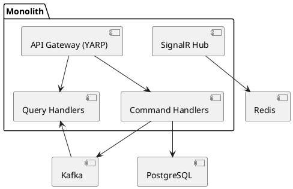
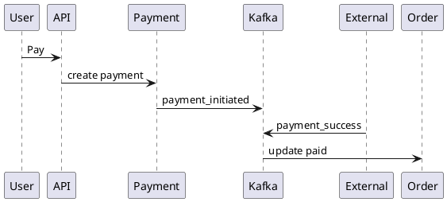

# SPEC-1-Uber-Food-Modular-Monolith

## Background

Combined ride-hailing + food delivery platform built as a **modular monolith (ASP.NET Core 8)** with clear boundaries to evolve into microservices. Designed from day one for **CQRS**, **event-driven flows (Kafka)**, **real-time tracking (SignalR + Redis)**, and **region partitioning** for future multi-region deployments.

---

## Requirements

### Must Have (M)
- Auth (users, drivers, restaurants)
- Ride booking + driver matching
- Food ordering + restaurant workflow
- Real-time tracking (≤1s latency)
- CQRS (separate read/write models)
- Kafka-based eventing
- Redis for geo + hot state
- Region-based partitioning
- Payments (mock integration)

### Should Have (S)
- Notifications (SignalR)
- Retry + idempotency
- Driver availability

### Could Have (C)
- Surge pricing
- Promotions

---

## Method

### Architecture (Modular Monolith + CQRS)

Write side (commands) and Read side (queries) separated per module:
- Ride (Command + Query)
- Order (Command + Query)
- Payment
- Tracking

Pattern:
- Controllers → Command Handlers (write)
- Controllers → Query Handlers (read)
- Writes emit Kafka events
- Reads served from denormalized tables

---

### Authentication & Authorization

- **Access model**: OAuth2-style bearer tokens with short-lived JWT access tokens + long-lived refresh tokens.
- **Roles (RBAC)**:
  - `rider`: request rides, place food orders, view own status.
  - `driver`: accept rides/orders, update location, update trip/delivery status.
  - `restaurant`: accept/prepare food orders and update readiness.
- **JWT claims** include `sub` (user id), `role`, `region_id`, and `exp`.
- **Token flow through YARP**:
  1. Client authenticates against Auth module and receives access + refresh token.
  2. Client calls `/v1/*` APIs with `Authorization: Bearer <access_token>`.
  3. YARP validates JWT signature/expiry and forwards role/subject claims to downstream handlers.
  4. Expired access tokens are renewed via `/v1/auth/refresh` using refresh token rotation.
- **Refresh strategy**:
  - Access token TTL: 15 minutes.
  - Refresh token TTL: 30 days, stored hashed and revocable.
  - On refresh: rotate refresh token, invalidate previous token, and issue new access token.

---

### Driver Matching Algorithm (Scored)

Instead of nearest-only, we compute a **matching score** and select the **highest** score:

Score = (w1 * proximity_score) + (w2 * driver_rating) + (w3 * availability_score)

Where:
- proximity_score = `1 / (1 + distance_km)` from Redis GEO distance
- driver_rating → from DB/cache
- availability_score → based on idle time

Flow:
1. Fetch nearby drivers (Redis GEO, radius 3–5km)
2. Enrich with rating + availability
3. Compute score
4. Select highest score

Pseudo:
```csharp
var candidates = geoDrivers.Select(d => new {
    d.Id,
    Score = w1 * (1.0 / (1.0 + d.DistanceKm)) + w2 * d.Rating + w3 * d.Availability
});

var best = candidates.OrderByDescending(x => x.Score).First();
```

---

### API Gateway + Rate Limiting

Use **YARP (Yet Another Reverse Proxy)** inside ASP.NET Core.

Responsibilities:
- Routing
- Authentication
- Rate limiting
- Region routing (based on region_id)

---

### Rate Limiting Strategy

Use **token bucket (Redis-backed)**:

Keys:
- rate_limit:rider:{userId}
- rate_limit:driver:{userId}
- rate_limit:restaurant:{userId}

Config:
- Rider: 100 requests / minute
- Driver: 300 requests / minute + 20 requests / second for location updates
- Restaurant: 200 requests / minute

Redis Lua script for atomicity.

---

### Component Diagram



---

### Region Partitioning

All entities include `region_id`.

Kafka topics:
- ride-events-{region}
- order-events-{region}
- payment-events-{region}
- ride-events-dlq-{region}
- order-events-dlq-{region}
- payment-events-dlq-{region}

Redis:
- driver_locations:{region}

---

### Real-Time Tracking

- Driver sends location every 2–3s
- Stored in Redis GEO
- SignalR pushes updates to clients
- Redis is also used as the **SignalR backplane** for multi-instance fan-out

---

### Payment Flow

- Payment initiated after ride/order creation
- Mock external provider (Stripe/GCash-like)
- Status via Kafka events



---

### Reliability Patterns

- Outbox Pattern (DB → Kafka)
- Idempotency keys
- Retry with backoff
- Kafka DLQ per region for permanently failing messages after max retries

---

### State Machines

#### Ride state machine

`requested → matched → en_route → arrived → completed → cancelled`

#### Food order state machine

`placed → accepted → preparing → ready → picked_up → delivered`

---

### Error Handling & Failure Modes

- **Zero candidates in matching**: ride remains `requested`; return `202 Accepted` with `pending_match` and retry matching with expanding radius/backoff.
- **Kafka consumer failures**: retry with exponential backoff + jitter; persist retry count; route to region DLQ after retry threshold.
- **Stale Redis GEO data**: require heartbeat TTL for online drivers; ignore drivers with expired heartbeat and trigger availability downgrade.
- **Payment callback timeout**: move payment to `pending_confirmation`, poll provider/webhook retry for bounded period (e.g., 15 min), then mark `failed_timeout` and emit compensating event.

---

### Observability

- **OpenTelemetry** for distributed tracing across gateway, handlers, Kafka producers/consumers, Redis, and PostgreSQL.
- **Structured logging** (JSON) with correlation IDs (`trace_id`, `ride_id`, `order_id`, `region_id`).
- **Health checks** for PostgreSQL, Redis, Kafka, and SignalR endpoint readiness/liveness.

---

## Implementation

### Tech
- ASP.NET Core 8
- PostgreSQL (write + read DB)
- Redis (geo + cache)
- Kafka (event bus)

---

### Write DB Schema

```sql
CREATE TABLE rides (
  id UUID PRIMARY KEY,
  rider_id UUID,
  driver_id UUID,
  status TEXT,
  region_id INT,
  version INT NOT NULL DEFAULT 1,
  created_at TIMESTAMP
);

CREATE TABLE restaurants (
  id UUID PRIMARY KEY,
  name TEXT NOT NULL,
  status TEXT NOT NULL,
  region_id INT NOT NULL,
  created_at TIMESTAMP
);

CREATE TABLE orders (
  id UUID PRIMARY KEY,
  rider_id UUID NOT NULL,
  restaurant_id UUID NOT NULL REFERENCES restaurants(id),
  driver_id UUID,
  status TEXT NOT NULL,
  total_amount NUMERIC NOT NULL,
  region_id INT NOT NULL,
  version INT NOT NULL DEFAULT 1,
  created_at TIMESTAMP
);

CREATE TABLE order_items (
  id UUID PRIMARY KEY,
  order_id UUID NOT NULL REFERENCES orders(id) ON DELETE CASCADE,
  item_name TEXT NOT NULL,
  quantity INT NOT NULL,
  unit_price NUMERIC NOT NULL,
  subtotal NUMERIC NOT NULL
);

CREATE TABLE payments (
  id UUID PRIMARY KEY,
  entity_id UUID,
  type TEXT,
  status TEXT,
  amount NUMERIC,
  region_id INT
);
```

Optimistic concurrency pattern (prevents double-acceptance race):

```sql
UPDATE rides
SET driver_id = :driverId,
    status = 'matched',
    version = version + 1
WHERE id = :rideId
  AND status = 'requested'
  AND version = :expectedVersion;
```

Apply the same `version`-checked update pattern on `orders` transitions.

---

### Read Model (Denormalized)

```sql
CREATE TABLE ride_views (
  ride_id UUID,
  driver_name TEXT,
  status TEXT,
  lat DOUBLE PRECISION,
  lng DOUBLE PRECISION
);
```

Updated via Kafka consumers.

---

### Redis GEO

```csharp
await redis.GeoAddAsync($"driver_locations:{regionId}", lng, lat, driverId);
```

---

### SignalR

```csharp
await _hub.Clients.Group(rideId)
    .SendAsync("location_update", lat, lng);
```

---

### Kafka + Outbox

```sql
CREATE TABLE outbox (
  id UUID,
  payload JSONB,
  status TEXT
);
```

Background worker publishes to Kafka.

---

### APIs

- POST /v1/rides/request
- POST /v1/orders/create
- POST /v1/payments/initiate
- POST /v1/drivers/location
- POST /v1/auth/refresh

---

### API Versioning

- Use URL-based versioning (`/v1/...`) at the gateway and module endpoints.
- Non-breaking additions stay in `v1`; breaking changes introduce `/v2`.
- Maintain at least one overlapping supported version during migrations.

---

### Schema Versioning & Data Migration

- Manage schema via versioned migrations (EF Core migrations or Flyway).
- Each migration is forward-only, idempotent in CI/CD, and tracked in schema history.
- For future service split, keep shared contracts backward-compatible and run expand/contract migrations.

---

### Scaling Plan

- Split modules → microservices
- Kafka already decouples
- Read DB per service
- Redis cluster per region

---

## Milestones

1. Base monolith + modules
2. CQRS setup
3. Redis geo tracking
4. Kafka + outbox
5. Ride + order flows
6. Payment integration
7. SignalR real-time
8. Load test targets:
   - 10,000 concurrent users
   - 120 ride requests/sec sustained
   - 80 food orders/sec sustained
   - API latency: p50 < 150ms, p95 < 400ms, p99 < 800ms (excluding external payment callback latency)

---

## Gathering Results

- Matching latency (<500ms)
- Tracking delay (<1s)
- Kafka lag
- Payment success rate
